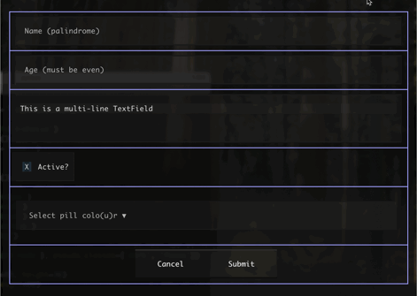
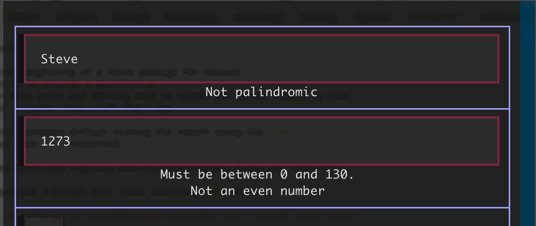
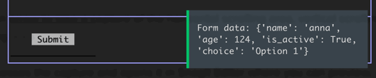

## textual_forms

This is the beginning of a forms package for textual. It provides a
declarative framework for data entry and editing that is usable and useful
enough to have people extend it rather than craft their own. With `uv`
installed you can run the demo program without cloning the repository with
the `uvx` command.

    uvx --from git+https://github.com/holdenweb/textual-forms.git forms-app

This should produce a window that looks something like the one
below. Terminate the run with CTRL-Q. The program is designed to let you
experiment. Please feel free to exercise it, tweak it and provide feedback as
issues against the repo, on the Textual Discord, or as email to
steve@holdenweb.com.



String-based inputs are validated on any change, and validation problems are reported
underneath the field in question. Pressing the form's Submit button checks that all
fields are valid, and if so posts a `Form.Submitted` Message; otherwise it
displays a notification to fix the fields. Pressing Cancel posts a
`Form.Cancelled` Message. Both Messages provide a reference to the form.



When the demo program receives `FormSubmitted` it notifies you of the values
you've entered as a dictionary, keyed by the field names.



Below is the source for the form from the demo program, which
contains an example of each of the currently-supported field types.

```python
from textual_forms.field import IntegerField, StringField, ChoiceField, BooleanField, TextField
from textual_forms.form import Form
from textual_forms.validators import EvenInteger, Palindromic
from textual.validation import Number


class TestForm(Form):
    name = StringField(
        placeholder="Name (palindrome)",
        required=True,
        validators=[Palindromic()],
        id="form-name",
    )
    age = IntegerField(
        placeholder="Age (must be even)",
        required=False,
        validators=[Number(minimum=0, maximum=130), EvenInteger()],
        id="form-age",
    )
    description = TextField(
        required=True,
        id="form-description",
        text="This is a multi-line TextField",
    )

    is_active = BooleanField(label="Active?", id="form-isactive")

    choice = ChoiceField(
        prompt="Select pill colo(u)r",
        choices=[("blue", "Blue"), ("red", "Red")],
        label="Selection",
        id="form-choice",
    )
```

### Testing

The Makefile offers a few targets to assist developers.
`make test` runs pytest, reporting each test on its own line.
`make coverage` runs pytest and reports on current test suite coverage.

`make release` prints the current release number.
`make release version=X.Y.Z` creates a new release tagged as `rX.Y.Z` locally.
New releases must be greater than their precursors.

Still missing is a `publish` target that will push the latest release,
and the new tag, to GitHub before publishing it on PyPi.
This last effect may well be most easily achieved via Github actions.

## Contribute!!

I have neither the time nor the energy to support this effort alone.
Various community members have been kind enough to offer encouragement,
and my hope is that this initial stimulus will inspire the `textual` community to help with
discussions on Discord, suggestions, issues - indeed, any kind of engagement.
Pull requests are always most valuable, but at this stage discussions,
suggestions and issues are just as necessary!

## Current State of Play

I have already identified a number of high-priority issues which are [logged
in the repository](https://github.com/holdenweb/textual-forms/issues). Some
of these notes are outdated and do not necessarily reflect current thinking -
for example, a FileField could (other than for textual-web) simply provide a path
to local filestore.

Differences between the desktop and textual-web environments will need
careful consideration. The library is now at the stage where it's a usable
tool for a limited subclass of data entry and editing tasks.

## Next Steps

1. Document the existing functionality to encourage adoption.
1. Document the addition of a new field type to encourage extension.
1. Enhance release process and extend to publishing via PyPI.
1. Write papers and present talks about Textual and this work.
1. Get people to use textual-forms!

### Architecture

The Form class is the basis of the library.
Forms contain one or more Fields,
each of which is associated with a Widget instance.
Each Field type has a default widget type.
The widdget can also be passed as an argument
when the Field instance is created.

When you create a form instance you can optionally provide a `data` mapping.
The fields whose names are keys in the mapping are populated with the
associated value.

Field types based on the Input widget are validated whenever their values
change. If a validator on a field fails then the validation message is
displayed underneath the field.

Create a Form subclass, and within it bind a number of Field instances to
class variables. The form's render method returns a Vertical in which each of
the fields' widgets in turn is rendered, followed by one or more buttons in a
row (usually Cancel and Submit, but a later API may allow modifications). You
can, of course, overwrite the Form's `render` method and styling to display
the widgets in any way you wish.

Setting a field's value inside the program propagates the change to the
widget's display. A field's value is also modified by changes to the widget
value from the TUI. After any programmatic change the field's validators will
be called, and any resulting ValidationErrors cause messages to display under
the field.

When a Form's `render` method is called all fields
whose names appear as keys in the `data` dict are set to the given
values; fields not included in the data are set to their default values, if
specified. If any fields are left without a value a ValueError exception is raised.
Otherwise the form components are mounted and become available for user
interaction.


### Specific refactorings

This package is currently in the alpha stage, with the proof-of-concept
demonstrating a clear ability to turn Form subclasses into interactive
Textual objects. The existing "framework" needs to be elaborated to improve
and formalise the Form-Field and the Field-Widget interfaces.

Astute readers will notice there is limited styling on the form components.
The proof-of-concept form could be improved in both styling and layout. The
appearance of `Select`s in particular could benefit from some work.

Otherwise, the primary needs are some decent docs and a greater diversity
of `Field` types to increase the versatility of the library.
After almost six months, it's now nearly capable of doing the job
I started writing it to do!